# 信息检索实验 —— TOP250 豆瓣电影短评爬虫与分析

## 项目概述

这个项目是我们这学期信息检索的实验，老师没做特殊的要求，只要求我们做个爬虫，对爬下来的信息进行一些处理，要做什么全看自己的兴趣，最好能和课上学的相关。因为去年看《Python3网络爬虫开发实战教程》记得有个爬电影的示例，以为是豆瓣电影的爬虫示例，所以本打算水一下改一下示例的代码交上去。只可惜后来发现示例是爬的猫眼电影，于是只能重新看一下爬虫教程改写豆瓣电影的爬虫。在写豆瓣电影爬虫过程中遇到了登录的滑动验证码和封号、封ip等问题，于是只能把《Python3网络爬虫开发实战教程》再看一遍才明白该怎么写...

其中项目目标参考了一位学长去年实验的难度和内容(毕竟只占20%成绩的实验我也不想写成课设...)，以及在Google豆瓣爬虫时看到的[豆瓣爬虫项目](https://github.com/iphysresearch/TOP250movie_douban#%E4%B8%80%E7%88%AC%E5%8F%96%E8%B1%86%E7%93%A3top250%E7%9A%84%E7%9F%AD%E8%AF%84%E6%95%B0%E6%8D%AE)

### 项目目标

本次我选择的实验题目是 豆瓣影评分析，包括但不限于爬取TOP250电影的所有短评以及电影的相关数据，运用神经网络对评论的评分进行预测和对情感进行分析，评论者的相关信息的可视化，电影类型对应的词云等，随着课程的推进为实验内容增加新的需求。

1. 爬取TOP250豆瓣电影所有短评，以及电影的相关信息，包括电影类型，上映时间，以及演员列表等信息；
2. 能够对短评的评分进行统计，以及某一类型电影下评论者的性别，年龄，加入豆瓣时间等，可视化表述统计结果，进而分析评论和电影类型的关系；
3. 能够分析指定电影指定时间段内的评论内容，包括对短评发表的频率统计，对短评内容的预处理，最终生成词云进行可视化表达；
4. 训练循环神经网络，学习短评的情感倾向和根据短评预测评分，测试数据使用再爬取的Mtime时光网的电影评论和评分。

## 项目构成

### Scrapy + Selenium 爬虫

#### 防反爬设置

和参考的爬虫项目一样，这个爬虫项目的大多数时间也花在了防反爬上。参考的爬虫项目反爬的设置没大看懂，于是自己根据书上的教程尝试防反爬策略，最重要的就是使用了selenium。其他的设置就是设置sleep时间等细枝末节，再就是log输出时最好设置成INFO，这样log内容可以更简洁，更容易看出自己爬虫的问题。

##### 踩过的坑

一开始尝试不使用scrapy框架直接爬取，这样可以爬取电影的具体信息，但只能爬取前10页短评，因为短评数量感觉有点少，所以尝试使用scrapy框架。
由于10页以后的短评必须要登录才可以爬取，看到书上有 CookiePool 和 ProxyPool，感觉这个对防反爬有帮助，于是看了一下教程将示例中的微博 CookiePool 改成[豆瓣CookiePool](https://github.com/DateBro/douban_movies_cookiepool)，其中做了对登录豆瓣时的滑动验证码的处理，通过selenium实现了自动完成验证码操作。
使用scrapy框架写好爬虫文件后，再将CookiePool和Proxy整合进来，发现一开始测试爬取几百条评论还能正常运行，但测试过三四次之后发现无法正常爬取。通过查看log文件和登录豆瓣发现由于爬取频率比较高被封号。分析之后感觉可能是因为六个账号多个ip登录被豆瓣后台检测出异常，毕竟挂代理登录豆瓣的时候会提示账号异地登录。
所以只能放弃已经废了一天弄完的CookiePool和ProxyPool，拜托同学帮忙注册一个豆瓣账号，尝试使用scrapy对接selenium完成爬虫。按照《Python3网络爬虫开发实战教程》的示例，将之前破解滑动验证码的部分整合到SeleniumMiddleware中。
这个时候测试，发现爬虫可以爬较长时间不被封ip，但测试的三次发现爬了大约12000条短评的时候就会异常，查看log文件发现error信息，感觉可能是被短时间封ip，因为重新启动爬虫仍然可以爬取短评。这个问题暂时没有想到好的解决方法，只能写一个shell脚本，每隔一段时间重新启动爬虫，而爬虫也在每次启动时读取一个txt文件中要爬取的电影范围。
经过测试发现，经过半天多就可以完成短评的爬取，由于豆瓣短评数量的限制，最终爬取的短评数量为 338143 条。

#### 爬取信息设置

TOP250_douban_movies 文件夹是 scrapy 项目文件夹，comments_spider.sh 是用于控制定时启动豆瓣短评爬虫的 shell 脚本。

一开始本来将三个爬虫写在一个文件里，想爬下电影链接解析后接着爬这部电影的短评，然后再爬取评论者的信息。但后来发现这样遇到bug时难debug，而且如果爬虫因为某些异常退出后重新启动爬取的代价比较大。最后分成三个爬虫，先调用 douban_movies 爬虫，然后才可以调用 comment_infos 爬虫，最后才能调用 commenter_infos 爬虫。

spiders 文件夹下有三个spider，分别是 douban_movies.py —— 用于爬取 TOP250 电影榜的电影名称和电影链接，以及爬取每部电影的具体信息；

TOP250 排行榜要爬取的信息：


TOP250MovieInfoItem 设置:
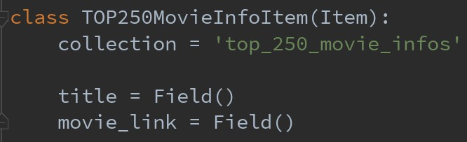

已爬取数据示例:
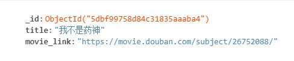

每部电影要爬取的具体信息：
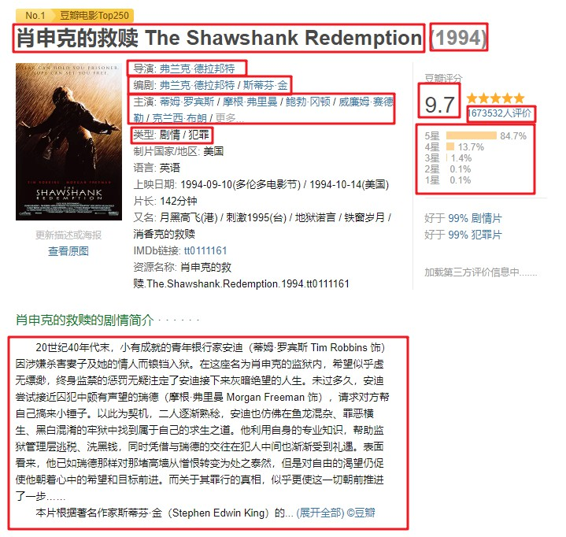


MovieInfoItem 设置：
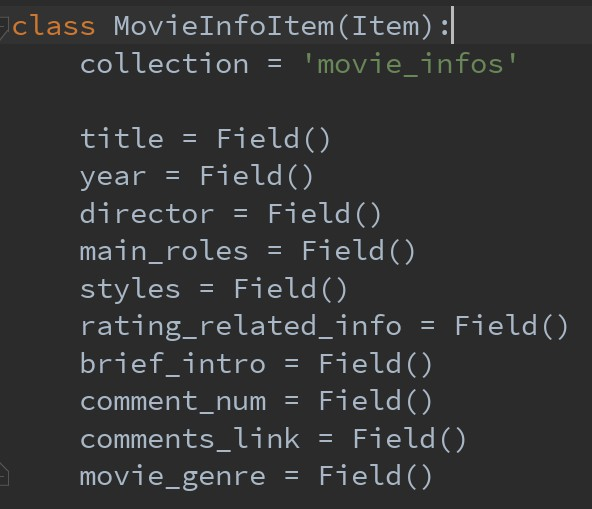

已爬取数据示例:
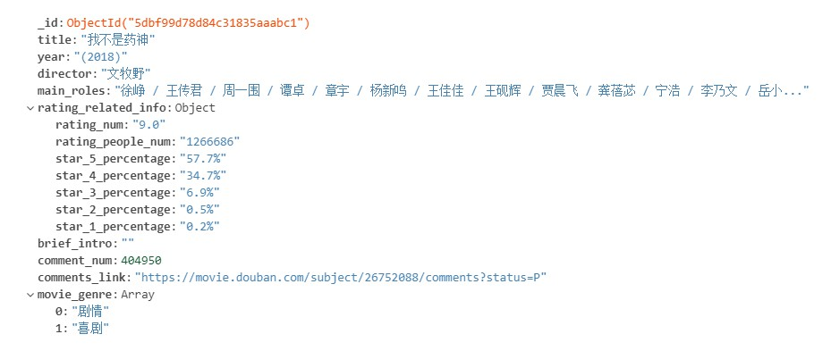

对于每部电影具体信息的爬取，并没有和参考的TOP250豆瓣电影爬虫一样，有的信息是感觉太多自己用不上，有的信息是感觉不好分析可能增加太多工作量...

comments.py —— 用于爬取每部电影的短评，由于豆瓣的限制，最多只能爬取好评、中评、差评各 500 条；

每条短评要爬取的具体信息：
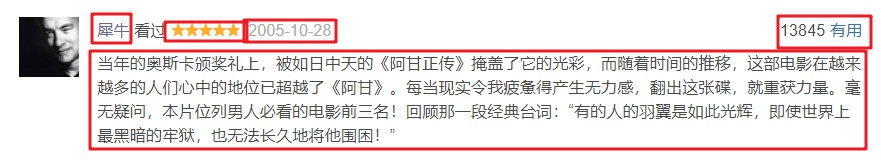

CommentInfoItem 设置：
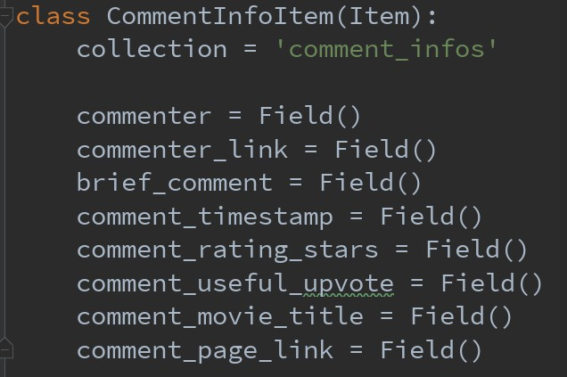

本来一开始没想存储这条短评的网页链接，但一开始运行完爬虫发现只爬了27万多条短评，和一开始估计的37万相差过多，虽然可能是因为有的电影中评和差评数量可能不足500条，以及爬的时间过程会被豆瓣封一段时间ip，但短评数量依然相差有点多。所以后面打算再爬一次，为了避免以后由于封ip中断爬虫导致需要重新爬取的问题，所以事先存下短评的网页链接，根据网页链接和评论者的链接判断是否爬过这条评论，这样就可以在爬取时防止爬取已经爬过的短评，可以多次运行爬虫爬取未爬过的数据。

已爬取数据示例:
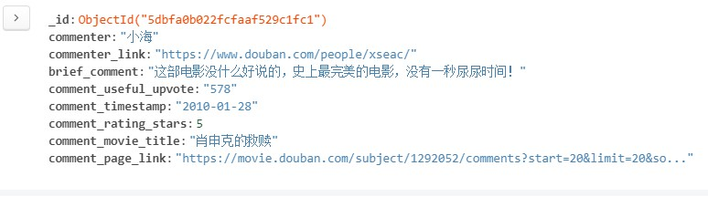

commenters.py —— 用于爬取每个短评的评论者的信息。

每位评论者要爬取的具体信息：
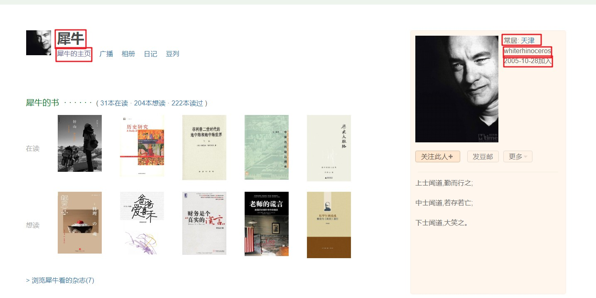


CommenterInfoItem 设置：
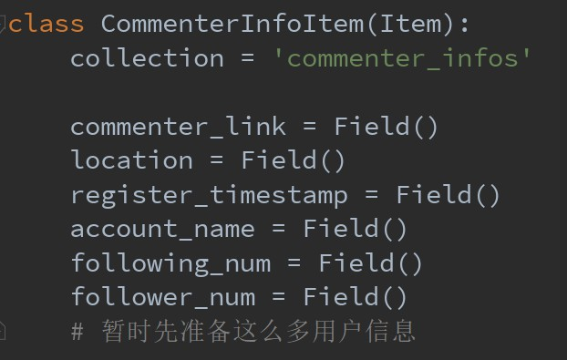

在爬取过程中查看log文件可以发现爬取评论者信息时的一些问题，比如 该用户已经主动注销帐号、没有填写常居地、账号根据用户管理细则已被永久停用等。对于常居地和注册时间爬取有问题的评论者可以以"未知"等默认值填充字段，但如果账号已注销或被停用则不储存评论者信息。

已爬取数据示例:


### 数据分析

数据分析的代码都放在 douban_movies_analysis 文件夹下，数据分析分为统计分析和深度学习模型分析，暂时只完成了部分统计分析，后面会逐步添加新的内容。

#### 统计分析

一开始数据分析的代码是非常繁琐冗长的，是每次直接从数据库中读取所需要分析的信息，放到一个列表或者字典中，然后进行统计。

这样写了大部分代码后想看一下 GitHub 上豆瓣电影影评分析是如何写的，然后发现之前的统计分析代码可以用 DataFrame 更简洁的 API 实现，于是又重新看了一下《Python数据科学手册》中 Pandas 部分，学习了一下 DataFrame 方法的使用，有的地方也参考了 GitHub 上影评分析作者的实现，重新用 DataFrame 实现了数据的统计分析。

##### movie 信息的分析

**载入电影信息的 DataFrame**

```python
def get_movie_dataframe():
    movie_info_dict_list = []
    movie_infos_collection = db['movie_infos']
    for movie_info in movie_infos_collection.find():
        movie_info_dict = {}
        movie_genre_list = movie_info['movie_genre']
        movie_title = movie_info['title']
        movie_title = movie_title.split(' ')[0]
        rating_related_info = movie_info['rating_related_info']

        movie_info_dict['movie_title'] = movie_title
        movie_info_dict['year'] = movie_info['year']
        movie_info_dict['director'] = movie_info['director']
        movie_info_dict['main_roles'] = movie_info['main_roles']
        movie_info_dict['comment_num'] = movie_info['comment_num']
        movie_info_dict['rating_num'] = rating_related_info['rating_num']
        movie_info_dict['rating_people_num'] = rating_related_info['rating_people_num']
        movie_info_dict['star_5_percentage'] = rating_related_info['star_5_percentage']
        movie_info_dict['star_4_percentage'] = rating_related_info['star_4_percentage']
        movie_info_dict['star_3_percentage'] = rating_related_info['star_3_percentage']
        movie_info_dict['star_2_percentage'] = rating_related_info['star_2_percentage']
        movie_info_dict['star_1_percentage'] = rating_related_info['star_1_percentage']
        movie_info_dict['comments_link'] = movie_info['comments_link']
        # genre 的处理暂时先这样
        movie_info_dict['movie_genre_list'] = movie_genre_list
        movie_info_dict['brief_intro'] = movie_info['brief_intro']
        movie_info_dict['util_num'] = 1

        movie_info_dict_list.append(movie_info_dict)

    movie_info_dataframe = pd.DataFrame(movie_info_dict_list)

    return movie_info_dataframe
```

获取电影评分前 rank_num 名：
```python
def stars_movies(rank_num=10):
    return dataframe.sort_values('rating_num', ascending=False)[['movie_title','rating_num']].head(rank_num)
```

分析前十名上榜电影最多的导演
```python
def director_movies(rank_num = 10):
    director_statistics = dataframe.groupby('director')['util_num'].sum()
    director_statistics = director_statistics.sort_values(ascending=False).head(rank_num)
    return director_statistics
```

分析投票数前rank_num名电影
```python
def rating_people_num_movies(rank_num=10):
    rating_people_num_statistics = dataframe.sort_values('rating_people_num', ascending=False)[['movie_title', 'rating_people_num']].head(rank_num)
    return rating_people_num_statistics
```

分析评论数前rank_num名电影
```python
def comments_num_movies(rank_num=10):
    comments_num_statistics = dataframe.sort_values('comment_num', ascending=False)[['movie_title', 'comment_num']].head(rank_num)
    return comments_num_statistics
```

分析电影上映年份的电影数量，打算以后实现通过绘图的功能
```python
def year_movies(rank_num=10):
    year_statistics = dataframe.groupby('year')['util_num'].sum()
    year_statistics = year_statistics.sort_values(ascending=False).head(rank_num)
    return year_statistics
```

对每部电影电影生成对应的词云
```python
def generate_movie_cloud():
    clouds_path = '../../cloud_imgs/movie_clouds/'
    comment_collection = db['comment_infos']
    # 先得到250部电影的title
    movie_comments_dict = get_movie_comments_dict()
    comment_infos = comment_collection.find()
    for comment_info in comment_infos:
        comment_movie = comment_info['comment_movie_title']
        comment_movie = comment_movie.split(' ')[0]
        brief_comment = comment_info['brief_comment']
        if comment_movie in movie_comments_dict.keys():
            movie_comments_dict[comment_movie].append(brief_comment)
        else:
            print('this movie is not in the dict')
            print(comment_movie)

    stop_words = init_stopwords()

    for movie_title in movie_comments_dict.keys():
        comment_words_df = get_movie_comments_words_dataframe(movie_title)
        comment_words_df = comment_words_df[~comment_words_df.comment_word.isin(stop_words.stopword)]

        # 统计词频
        words_stat = comment_words_df.groupby(by=['comment_word'])['comment_word'].agg({"计数": np.size})
        words_stat = words_stat.reset_index().sort_values(by=["计数"], ascending=False)

        word_frequency = {x[0]: x[1] for x in words_stat.head(1000).values}

        store_path = clouds_path + str(movie_title)
        word_cloud = WordCloud(
            font_path="../../fonts/JingDianWeiBeiJian-1.ttf",
            background_color='white',
            max_words=200,
            max_font_size=200,
            width=1400,
            height=800
        )
        word_cloud.fit_words(word_frequency)
        word_cloud.to_file(store_path + ".jpg")
```

黑客帝国的词云：


可以看到词云中仍有一些停用词没有过滤掉的词汇，比如“电影”，对于影评分析来说这也应该放到停用词中，还有一些英文和数字也应该被过滤掉，打算以后在停用词表中添上这些要过滤掉的词。

##### 短评的分析

**获取某一种类型电影短评的 DataFrame**

```python
def get_genre_comments_words_dataframe(genre='剧情'):
    brief_comments_list = []
    comment_infos_collection = db['comment_infos']
    comment_movie_genre_dict = get_movie_genre_dict()
    for comment_info in comment_infos_collection.find():
        comment_movie_title = comment_info['comment_movie_title']
        comment_movie_genre_list = comment_movie_genre_dict[comment_movie_title]
        if genre in comment_movie_genre_list:
            brief_comments_list.append(comment_info['brief_comment'])

    comment_words = []
    for comment in brief_comments_list:
        comment_seqs = jieba.lcut(comment)
        for single_comment_seq in comment_seqs:
            comment_words.append(single_comment_seq)

    comment_words_df = pd.DataFrame({'comment_word': comment_words})
    return comment_words_df
```

分析指定电影其短评的发表时间频率（以年计），即将时间跨度等分，统计每个时间跨度内的短评数量，打算以后做一下根据这个的绘图
```python
def comments_year_frequency(rank_num=10):
    year_comment_df = dataframe.groupby('commenter').apply(comment_df_year)
    year_comment_statistics = year_comment_df.groupby('comment_timestamp')['util_num'].sum()
    year_comment_statistics = year_comment_statistics.sort_values(ascending=False).head(rank_num)
    return year_comment_statistics
```

测试了所有短评数量最多的前十年：

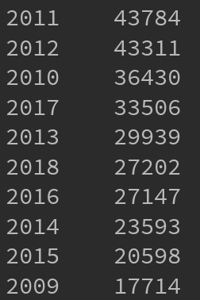

分析指定电影其短评的发表时间频率（以月计）
```python
def comments_month_frequency(rank_num=10):
    month_comment_df = dataframe.groupby('commenter').apply(comment_df_month)
    month_comment_statistics = month_comment_df.groupby('comment_timestamp')['util_num'].sum()
    month_comment_statistics = month_comment_statistics.sort_values(ascending=False).head(rank_num)
    return month_comment_statistics
```

测试了所有短评数量最多的前十个月：

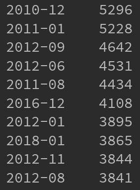

对电影的每种类型生成对应的词云
```python
def generate_genre_cloud():
    clouds_path = '../../cloud_imgs/genre_clouds/'
    comment_collection = db['comment_infos']
    movie_genres_dict = get_movie_genre_dict()
    genres_comments_dict = get_genre_dict()

    for comment_info in comment_collection.find():
        # 用电影名找到这个评论对应电影的类型
        comment_movie = comment_info['comment_movie_title']
        comment_movie = comment_movie.split(' ')[0]
        brief_comment = comment_info['brief_comment']
        comment_movie_genres_list = movie_genres_dict[comment_movie]

        for comment_movie_genre in comment_movie_genres_list:
            if comment_movie_genre in genres_comments_dict.keys():
                genres_comments_dict[comment_movie_genre].append(brief_comment)
            else:
                print('comment_movie_genre is not in the genres_comments_dict')
                print(comment_movie_genre)

    stop_words = init_stopwords()

    for genre in genres_comments_dict.keys():
        comment_words_df = get_genre_comments_words_dataframe(genre)
        comment_words_df = comment_words_df[~comment_words_df.comment_word.isin(stop_words.stopword)]

        # 统计词频
        words_stat = comment_words_df.groupby(by=['comment_word'])['comment_word'].agg({"计数": np.size})
        words_stat = words_stat.reset_index().sort_values(by=["计数"], ascending=False)

        word_frequency = {x[0]: x[1] for x in words_stat.head(1000).values}

        store_path = clouds_path + str(genre)
        word_cloud = WordCloud(
            font_path="../../fonts/JingDianWeiBeiJian-1.ttf",
            background_color='white',
            max_words=200,
            max_font_size=200,
            width=1400,
            height=800
        )
        word_cloud.fit_words(word_frequency)
        word_cloud.to_file(store_path + ".jpg")
```

武侠片的词云：


可以看到有前面每部电影词云的问题，不少应该过滤掉的词汇还留着。

##### commenter 信息的分析

commenter 信息的分析还没有写....