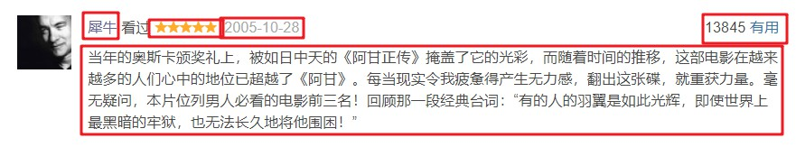

# 信息检索课程实验报告final

姓名：赵志勇
学号：201700301148
班级：2017级人工智能实验班

## 目录

- [一、摘要](#摘要)
  - [题目概述](#题目概述)
  - [功能介绍](#功能介绍)
  - [开发平台及开源工具](#开发平台及开源工具)
- [二、选题意义](#选题意义)
- [三、工作流程梳理](#工作流程管理)
  - [3.1系统模块设计](#系统模块设计)
    - [3.1.1信息爬取模块](#信息爬取模块)
    - [3.1.2信息统计分析模块](#信息统计分析模块)
    - [3.1.3信息深度学习分析模块](#信息深度学习分析模块)
  - [3.2详细设计](#详细设计)
    - [3.2.1信息爬取](#信息爬取)
    - [3.2.2电影信息统计及分析](#电影信息统计及分析)
    - [3.2.3短评信息统计及分析](#短评信息统计及分析)
    - [3.2.4短评人信息统计及分析](#短评人信息统计及分析)
    - [3.2.5深度学习分析](#深度学习分析)
- [四、最终结果](#最终结果)
  - [4.1运行截图及结果分析](#运行截图及结果分析)
  - [4.2数据量](#数据量)
  - [4.3性能评价](#性能评价)
- [五、总结与体会](#总结体会)

<span id="摘要"></span>

## 摘要

<span id="题目概述"></span>

### 1.1 题目概述

本次我选择的实验题目是 豆瓣影评分析，包括但不限于爬取TOP250电影的所有短评以及电影的相关数据，运用神经网络对评论的评分进行预测和对情感进行分析，评论者的相关信息的可视化，电影类型对应的词云等，随着课程的推进为实验内容增加新的需求。

<span id="功能介绍"></span>

### 1.2 功能介绍

1.	爬取TOP250豆瓣电影所有短评，以及电影的相关信息，包括电影类型，上映时间，以及演员列表等信息；
2.	能够对短评的评分进行统计，以及某一类型电影下评论者的性别，年龄，加入豆瓣时间等，可视化表述统计结果，进而分析评论和电影类型的关系；
3.	能够分析指定电影指定时间段内的评论内容，包括对短评发表的频率统计，对短评内容的预处理，最终生成词云进行可视化表达；
4.	训练循环神经网络，学习短评的情感倾向和根据短评预测短评的情感倾向。

<span id="开发平台及开源工具"></span>

### 1.3 开发平台及开源工具

本次信息检索实验使用的是 python 语言，开发工具为 IntelliJ IDEA，
操作系统为 Windows 10 和 Ubuntu 18.04 服务器，第三方库均使用 pip 安装。
本次实验使用的第三方库主要有selenium(自动登录与信息爬取)、
matplotlib(词频统计可视化)、numpy(矩阵处理)、
jieba(分词)、wordcloud(制作词云)、geopandas(绘制地图)、OpenCV(破解滑动验证码)、pymongo(将数据存到MongoDB中)等。

<span id="选题意义"></span>

## 选题意义

在选题方面还是废了一番力气的，最终还是打算从豆瓣电影入手。
一方面，因为经常看电影，每次看电影之前都会在豆瓣看一下评分和大家的短评，对于自己筛选电影有很大的帮助；
另一方面，因为之前虽然也学习过爬虫的一些技术，但大多是按照书上的教程敲得代码，没有自己思考遇到某个困难后如何克服，没有自己思考过如何实现某个功能，所以希望通过这次信息检索实验好好练习一下写爬虫，想着豆瓣影评信息的爬取应该不会太简单（因为豆瓣作为一个比较权威的文青平台，对于大量影评信息的爬取还是有一定防范的），觉得也是一个小小的挑战。
总的来说，我觉得这个选题应该也是可以让所有的同学都比较感兴趣的一个题目，因为这是大家生活共有的一个方面。

<span id="工作流程管理"></span>

## 工作流程管理

### 3.1 系统模块设计

#### 3.1.1信息爬取模块

信息爬取是所有实验内容展开的基础，后续的实验都将依赖于爬取到的数据。实现模拟自动登录，登录给定账号的豆瓣页面，从TOP250电影排行榜里爬取到250部电影的信息和url，然后根据url爬取相关电影的具体信息，然后根据电影页面的短评url爬取好中差三种短评各约500条。

#### 3.1.2 信息统计分析模块

信息统计分析主要是对短评的评分进行统计，以及某一类型电影下评论者的性别，年龄，加入豆瓣时间等，可视化表述统计结果，进而分析评论和电影类型的关系，以及分析指定电影指定时间段内的评论内容，包括对短评发表的频率统计，对短评内容的预处理，最终生成词云进行可视化表达等。

#### 3.1.3 信息深度学习分析模块

信息深度学习分析主要是根据爬取到的短评训练一个RNN网络，对给定影评分析其情感倾向，评分3分及以上视为积极，其余视为消极。

### 3.2 详细设计

#### 3.2.1 信息爬取

TOP250_douban_movies 文件夹是 scrapy 项目文件夹，comments_spider.sh 是用于控制定时启动豆瓣短评爬虫的 shell 脚本。

一开始本来将三个爬虫写在一个文件里，想爬下电影链接解析后接着爬这部电影的短评，然后再爬取评论者的信息。但后来发现这样遇到bug时难debug，而且如果爬虫因为某些异常退出后重新启动爬取的代价比较大。最后分成三个爬虫，先调用 douban_movies 爬虫，然后才可以调用 comment_infos 爬虫，最后才能调用 commenter_infos 爬虫。

spiders 文件夹下有三个spider，分别是 douban_movies.py —— 用于爬取 TOP250 电影榜的电影名称和电影链接，以及爬取每部电影的具体信息；

##### 文件说明

##### pipeline.py

根据书上的示例只修改了 open_spider 和 process_item 方法

```python
# 因为在 process_item 中会根据不同的 Item 进行不同的查询防止爬取重复的信息，所以对不同的 collection 设置了不同的索引，毕竟最后爬取到的短评有 33 万多条，设置一下索引对速度还是有提升的
def open_spider(self, spider):
        self.client = pymongo.MongoClient(self.mongo_uri)
        self.db = self.client[self.mongo_db]
        self.db[TOP250MovieInfoItem.collection].create_index([('movie_link', pymongo.ASCENDING)])
        self.db[MovieInfoItem.collection].create_index([('movie_link', pymongo.ASCENDING)])
        self.db[CommentInfoItem.collection].create_index([('commenter_link', pymongo.ASCENDING), ('comment_page_link', pymongo.ASCENDING)])
        self.db[CommenterInfoItem.collection].create_index([('commenter_link', pymongo.ASCENDING)])

# process_item 主要是根据不同的 Item 进行查询是否重复和插入
def process_item(self, item, spider):
        if isinstance(item, TOP250MovieInfoItem):
            condition = {'movie_link': item.get('movie_link')}
        elif isinstance(item, MovieInfoItem):
            condition = {'comments_link': item.get('comments_link')}
        elif isinstance(item, CommentInfoItem):
            condition = {'commenter_link': item.get('commenter_link'),
                         'comment_page_link': item.get('comment_page_link')}
        elif isinstance(item, CommenterInfoItem):
            condition = {'commenter_link': item.get('commenter_link')}

        result = self.db[item.collection].find_one(condition)
        if result is None:
            self.db[item.collection].insert(dict(item))
        return item
```

##### middleware.py

middleware 中只使用了 SeleniumMiddleware，其中大部分代码是破解模拟登录时破解滑动验证码，由于代码比较多，破解滑动验证码的具体代码请自行查看。

```python
def process_request(self, request, spider):
        self.logger.info('PhantomJS is Starting')
        try:
            self.browser.get(request.url)
            time.sleep(1)
            html = self.browser.page_source
            current_url = request.url

            try:
                need_login = self.browser.find_element_by_xpath('//*[@id="db-global-nav"]/div/div[1]/a')
                self.logger.info('需要登录')
                login_link = need_login.get_attribute('href')
                self.open(login_link)
                if self.password_error():
                    self.logger.info('用户名或密码错误')
                # 如果不需要验证码直接登录成功
                if self.login_successfully():
                    self.logger.info('不需要验证码直接登录成功')
                    # 登陆成功以后跳回原来的页面
                    self.browser.get(current_url)
                else:
                    # 需要验证码的情况下登录
                    self.login_with_auth()
                    if self.login_successfully():
                        self.logger.info('需要验证码的情况下登录成功')
                        # 登陆成功以后跳回原来的页面
                        self.browser.get(current_url)
                    elif self.password_error():
                        self.logger.info('需要验证码的情况下登录，用户名或密码错误')
                    else:
                        self.logger.info('需要验证码的情况下登录，登录失败')
            except NoSuchElementException:
                self.logger.info('现在不需要登录，所以找不到登录元素')

            # 需要让浏览器模拟随机滑动页面，模拟人的行为
            random_scroll_nums = random.randint(0, 1)
            for i in range(random_scroll_nums):
                random_scroll_distance1 = random.randint(200, 5000)
                js = 'var q=document.documentElement.scrollTop=' + str(random_scroll_distance1)
                self.browser.execute_script(js)
                time.sleep(0.3)
                random_scroll_distance2 = random.randint(200, 5000)
                js = 'var q=document.documentElement.scrollTop=' + str(random_scroll_distance2)
                self.browser.execute_script(js)
                time.sleep(0.3)

            random_sleep = random.uniform(0.2, 0.8)
            time.sleep(random_sleep)

            return HtmlResponse(url=request.url, body=html, request=request, encoding='utf-8',
                                status=200)
        except TimeoutException:
            self.logger.error('self.browser.get(request.url) happened TimeoutException')
            return HtmlResponse(url=request.url, status=500, request=request)
        except Exception:
            self.logger.error('self.browser.get(request.url) happened error')
            return HtmlResponse(url=request.url, status=500, request=request)
```

##### douban_movies.py

主要就是构造 TOP250 排行榜每一页的链接，然后解析每一页的电影名和电影页链接，然后发出爬取电影页信息的 Request，之后利用 xpath 或者 pyquery 正常解析网页信息即可。

```python
def start_requests(self):
        base_url = 'https://movie.douban.com/top250?start=$&filter='
        for start in range(10):
            url = str.replace(base_url, '$', str(start * 25))
            self.logger.info(url)
            yield Request(url, callback=self.parse_top250)

def parse_top250(self, response):
        top250_movie_info_item = TOP250MovieInfoItem()
        html = response.text
        doc = pq(html)
        all_movies = doc('#content > div > div.article > ol > li > div > div.info')
        for movie in all_movies.items():
            sleep_time = random.uniform(0.5, 1)
            time.sleep(sleep_time)

            movie_link = movie('div.hd > a').attr('href')
            title = movie('div.hd > a > span.title').text()
            top250_movie_info_item['title'] = title
            top250_movie_info_item['movie_link'] = movie_link
            self.logger.info(top250_movie_info_item)
            yield top250_movie_info_item
            # 然后发出爬取每个 movie 的具体信息的 request
            self.logger.info(movie_link)
            yield Request(movie_link, callback=self.parse_movie_item)
```

##### comments.py

短评的爬取过程和电影信息爬取略有不同，因为在爬取短评大约 40 分钟之后就会无法爬取，查看日志文件发现报错全是 Retry，估计是被检测到异常暂时不允许访问，所以写一个 shell 脚本，每隔 40 分钟启动一次爬虫，因为每次爬虫都是爬取几部电影的短评，所以在一个 txt 文件中写一个接下来要爬取的电影 index，一开始是 0，每次爬虫都会 +10，所以经过 25 次就能结束爬虫。具体爬取的思路和电影信息的爬虫差不多，请自行查看。

```python
def start_requests(self):
        # 每次都要读取这次要开始爬的电影的链接index
        with open('/home/zhiyong/data/next_link_num.txt', 'rt') as f:
            # with open('E:\PycharmProjects\some_data/next_link_num.txt', 'rt') as f:
            next_link_index = f.read()
            next_link_index = int(next_link_index)

        # 将后面开始读的电影索引 + 10 写入文件
        with open('/home/zhiyong/data/next_link_num.txt', 'wt') as f:
            # with open('E:\PycharmProjects\some_data/next_link_num.txt', 'wt') as f:
            new_next_link_index = next_link_index + 10
            f.write(str(new_next_link_index))

        # 后面可以加一个从数据库中读取已爬取的comment链接去重
        movie_link_list = self.get_movie_link_list()
        comment_page_link_list = self.get_comment_page_link_list()

        for index in range(next_link_index, new_next_link_index):
            if index >= 250:
                break
            movie_link = movie_link_list[index]
            time.sleep(3)

            # 分别爬取好评，中评，差评
            choices = ['h', 'm', 'l']
            for choice in choices:
                # 爬取每种评论之前先 sleep 一段时间
                every_type_comments_sleep = random.randint(2, 5)
                time.sleep(every_type_comments_sleep)

                comment_suffix = 'comments?start=$&limit=20&sort=new_score&status=P'
                real_comments_link = movie_link + comment_suffix
                if choice == 'h':
                    real_comments_link = real_comments_link + '&percent_type=h'
                elif choice == 'l':
                    real_comments_link = real_comments_link + '&percent_type=l'
                else:
                    real_comments_link = real_comments_link + '&percent_type=m'

                for start in range(25):
                    tmp_link = real_comments_link
                    request_comments_link = str.replace(tmp_link, '$', str(start * 20))
                    if request_comments_link not in comment_page_link_list:
                        # 然后可以爬取每个 movie 的短评信息
                        self.logger.info(request_comments_link)
                        yield Request(url=request_comments_link, callback=self.parse_comments)
                    else:
                        self.logger.info(request_comments_link)
                        self.logger.info('该链接已经爬取过')
```

##### commenters.py

现阶段爬取评论者的问题主要是速度太慢，毕竟一个网页最多只有一个用户的信息，再就是爬取时间过长也容易遇到 Retry 的问题，打算后面考虑一下有没有什么弥补措施。

```python
def start_requests(self):
        commenter_link_list = self.get_commenter_link_list()
        crawled_commenter_link_list = self.get_crawled_commenter_link_list()

        for commenter_link in commenter_link_list:
            if commenter_link not in crawled_commenter_link_list:
                crawled_commenter_link_list.append(commenter_link)
                time.sleep(4)
                self.logger.info(commenter_link)
                yield Request(url=commenter_link, callback=self.parse_commenters)
```

评论者信息爬取过程和前面其他爬虫最大的不同就是解析网页时一些异常情况的处理，比如账号已注销，账号已被永久停用等...其他地方和前面的爬虫大同小异。

```python
def parse_commenters(self, response):
        commenter_info_item = CommenterInfoItem()

        commenter_link = response.xpath('//*[@id="db-usr-profile"]/div[2]/ul/li[1]/a/@href').extract()
        try:
            commenter_link = commenter_link[0]
        except IndexError:
            # 已经注销账号的用户会出错
            self.logger.info('该用户已经主动注销帐号')
            return

        commenter_info_item['commenter_link'] = commenter_link

        location = response.xpath('//*[@id="profile"]/div/div[2]/div[1]/div/a/text()').extract()
        if location is None:
            lcoation = '未知'
        else:
            try:
                location = location[0]
            except IndexError:
                lcoation = '未知'
        commenter_info_item['location'] = location

        register_timestamp = response.xpath('//*[@id="profile"]/div/div[2]/div[1]/div/div/text()[2]').extract()
        try:
            register_timestamp = register_timestamp[0]
            # 截取 xxxx-xx-xx 日期
            result = re.findall('(.*)加入', register_timestamp)
            register_timestamp = result[0]
            register_timestamp = register_timestamp[0:10]
        except IndexError:
            # 因为有的账号根据log查看后发现是被永久停用的，没法获取注册时间
            register_timestamp = datetime.date.today()

        commenter_info_item['register_timestamp'] = register_timestamp

        account_name = response.xpath('//*[@id="profile"]/div/div[2]/div[1]/div/div/text()[1]').extract()
        try:
            account_name = account_name[0]
            account_name = str.strip(account_name)
            commenter_info_item['account_name'] = account_name[0]
        except IndexError:
            # 这种情况是 依据用户管理细则，帐号已被永久停用。
            self.logger.info('该依据用户管理细则，帐号已被永久停用')
            return

        following_num = response.xpath('//*[@id="friend"]/h2/span/a/text()').extract()
        try:
            following_num = following_num[0]
            # 截取 成员xxx 中的数字
            commenter_info_item['following_num'] = following_num[2:]
        except IndexError:
            # 如果没有关注的人的话没有用户关注多少人，但会有被0人关注
            following_num = 0

        follower_num = response.xpath('//*[@id="content"]/div/div[2]/p[1]/a/text()').extract()
        follower_num = follower_num[0]
        result = re.findall("被(.*)人关注", follower_num)
        follower_num = result[0]
        commenter_info_item['follower_num'] = follower_num
        self.logger.info(commenter_info_item)
        yield commenter_info_item
```

##### comments_spider.sh

在菜鸟教程和博客园看了一点 shell 的基础知识和教程写的脚本，大神可以尝试用一下 crontab 执行定时任务（看了半天没看懂咋用...）。

```shell
#! /bin/bash
cd /home/zhiyong/pycharm_projects/TPO250_douban_movies/
n=1
while (( $n <= 26 ))
do
    echo $n
    (( n++ ))
    scrapy crawl comments >> movie_comments.log 2>&1 &
    sleep 2400
done
```

##### 运行

直接在命令行执行命令即可：

先启动爬取电影信息的爬虫；

```shell
scrapy crawl douban_movies

# 或者后台执行，将输出重定向到日志文件中
nohup scrapy crawl douban_movies > douban_movies.log 2>&1 &
```

再启动爬取评论的爬虫（因为短评的网页链接需要根据数据库里的电影链接构造）;

```shell
scrapy crawl comments

# 或者后台执行，将输出重定向到日志文件中
nohup scrapy crawl comments > comments.log 2>&1 &
```

最后才可以爬取评论者的信息；

```python
scrapy crawl commenters

# 或者后台执行，将输出重定向到日志文件中
nohup scrapy crawl commenters > commenters.log 2>&1 &
```

#### 3.2.2 电影信息统计及分析

##### movie 信息的分析

**载入电影信息的 DataFrame**

```python
def get_movie_dataframe():
    movie_info_dict_list = []
    movie_infos_collection = db['movie_infos']
    for movie_info in movie_infos_collection.find():
        movie_info_dict = {}
        movie_genre_list = movie_info['movie_genre']
        movie_title = movie_info['title']
        movie_title = movie_title.split(' ')[0]
        rating_related_info = movie_info['rating_related_info']

        movie_info_dict['movie_title'] = movie_title
        movie_info_dict['year'] = movie_info['year']
        movie_info_dict['director'] = movie_info['director']
        movie_info_dict['main_roles'] = movie_info['main_roles']
        movie_info_dict['comment_num'] = movie_info['comment_num']
        movie_info_dict['rating_num'] = rating_related_info['rating_num']
        movie_info_dict['rating_people_num'] = rating_related_info['rating_people_num']
        movie_info_dict['star_5_percentage'] = rating_related_info['star_5_percentage']
        movie_info_dict['star_4_percentage'] = rating_related_info['star_4_percentage']
        movie_info_dict['star_3_percentage'] = rating_related_info['star_3_percentage']
        movie_info_dict['star_2_percentage'] = rating_related_info['star_2_percentage']
        movie_info_dict['star_1_percentage'] = rating_related_info['star_1_percentage']
        movie_info_dict['comments_link'] = movie_info['comments_link']
        # genre 的处理暂时先这样
        movie_info_dict['movie_genre_list'] = movie_genre_list
        movie_info_dict['brief_intro'] = movie_info['brief_intro']
        movie_info_dict['util_num'] = 1

        movie_info_dict_list.append(movie_info_dict)

    movie_info_dataframe = pd.DataFrame(movie_info_dict_list)

    return movie_info_dataframe
```

获取电影评分前 rank_num 名：
```python
def stars_movies(rank_num=10):
    return dataframe.sort_values('rating_num', ascending=False)[['movie_title','rating_num']].head(rank_num)
```

分析前十名上榜电影最多的导演
```python
def director_movies(rank_num = 10):
    director_statistics = dataframe.groupby('director')['util_num'].sum()
    director_statistics = director_statistics.sort_values(ascending=False).head(rank_num)
    return director_statistics
```

分析投票数前rank_num名电影
```python
def rating_people_num_movies(rank_num=10):
    rating_people_num_statistics = dataframe.sort_values('rating_people_num', ascending=False)[['movie_title', 'rating_people_num']].head(rank_num)
    return rating_people_num_statistics
```

分析评论数前rank_num名电影
```python
def comments_num_movies(rank_num=10):
    comments_num_statistics = dataframe.sort_values('comment_num', ascending=False)[['movie_title', 'comment_num']].head(rank_num)
    return comments_num_statistics
```

分析电影上映年份的电影数量，打算以后实现通过绘图的功能
```python
def year_movies(rank_num=10):
    year_statistics = dataframe.groupby('year')['util_num'].sum()
    year_statistics = year_statistics.sort_values(ascending=False).head(rank_num)
    return year_statistics
```

对每部电影电影生成对应的词云
```python
def generate_movie_cloud():
    clouds_path = '../../cloud_imgs/movie_clouds/'
    comment_collection = db['comment_infos']
    # 先得到250部电影的title
    movie_comments_dict = get_movie_comments_dict()
    comment_infos = comment_collection.find()
    for comment_info in comment_infos:
        comment_movie = comment_info['comment_movie_title']
        comment_movie = comment_movie.split(' ')[0]
        brief_comment = comment_info['brief_comment']
        if comment_movie in movie_comments_dict.keys():
            movie_comments_dict[comment_movie].append(brief_comment)
        else:
            print('this movie is not in the dict')
            print(comment_movie)

    stop_words = init_stopwords()

    for movie_title in movie_comments_dict.keys():
        comment_words_df = get_movie_comments_words_dataframe(movie_title)
        comment_words_df = comment_words_df[~comment_words_df.comment_word.isin(stop_words.stopword)]

        # 统计词频
        words_stat = comment_words_df.groupby(by=['comment_word'])['comment_word'].agg({"计数": np.size})
        words_stat = words_stat.reset_index().sort_values(by=["计数"], ascending=False)

        word_frequency = {x[0]: x[1] for x in words_stat.head(1000).values}

        store_path = clouds_path + str(movie_title)
        word_cloud = WordCloud(
            font_path="../../fonts/JingDianWeiBeiJian-1.ttf",
            background_color='white',
            max_words=200,
            max_font_size=200,
            width=1400,
            height=800
        )
        word_cloud.fit_words(word_frequency)
        word_cloud.to_file(store_path + ".jpg")
```

#### 3.2.3 短评信息统计及分析

**获取某一种类型电影短评的 DataFrame**

```python
def get_genre_comments_words_dataframe(genre='剧情'):
    brief_comments_list = []
    comment_infos_collection = db['comment_infos']
    comment_movie_genre_dict = get_movie_genre_dict()
    for comment_info in comment_infos_collection.find():
        comment_movie_title = comment_info['comment_movie_title']
        comment_movie_genre_list = comment_movie_genre_dict[comment_movie_title]
        if genre in comment_movie_genre_list:
            brief_comments_list.append(comment_info['brief_comment'])

    comment_words = []
    for comment in brief_comments_list:
        comment_seqs = jieba.lcut(comment)
        for single_comment_seq in comment_seqs:
            comment_words.append(single_comment_seq)

    comment_words_df = pd.DataFrame({'comment_word': comment_words})
    return comment_words_df
```

分析指定电影其短评的发表时间频率（以年计），即将时间跨度等分，统计每个时间跨度内的短评数量，打算以后做一下根据这个的绘图
```python
def comments_year_frequency(rank_num=10):
    year_comment_df = dataframe.groupby('commenter').apply(comment_df_year)
    year_comment_statistics = year_comment_df.groupby('comment_timestamp')['util_num'].sum()
    year_comment_statistics = year_comment_statistics.sort_values(ascending=False).head(rank_num)
    return year_comment_statistics
```

测试了所有短评数量最多的前十年：


分析指定电影其短评的发表时间频率（以月计）
```python
def comments_month_frequency(rank_num=10):
    month_comment_df = dataframe.groupby('commenter').apply(comment_df_month)
    month_comment_statistics = month_comment_df.groupby('comment_timestamp')['util_num'].sum()
    month_comment_statistics = month_comment_statistics.sort_values(ascending=False).head(rank_num)
    return month_comment_statistics
```

测试了所有短评数量最多的前十个月：


对电影的每种类型生成对应的词云
```python
def generate_genre_cloud():
    clouds_path = '../../cloud_imgs/genre_clouds/'
    comment_collection = db['comment_infos']
    movie_genres_dict = get_movie_genre_dict()
    genres_comments_dict = get_genre_dict()

    for comment_info in comment_collection.find():
        # 用电影名找到这个评论对应电影的类型
        comment_movie = comment_info['comment_movie_title']
        comment_movie = comment_movie.split(' ')[0]
        brief_comment = comment_info['brief_comment']
        comment_movie_genres_list = movie_genres_dict[comment_movie]

        for comment_movie_genre in comment_movie_genres_list:
            if comment_movie_genre in genres_comments_dict.keys():
                genres_comments_dict[comment_movie_genre].append(brief_comment)
            else:
                print('comment_movie_genre is not in the genres_comments_dict')
                print(comment_movie_genre)

    stop_words = init_stopwords()

    for genre in genres_comments_dict.keys():
        comment_words_df = get_genre_comments_words_dataframe(genre)
        comment_words_df = comment_words_df[~comment_words_df.comment_word.isin(stop_words.stopword)]

        # 统计词频
        words_stat = comment_words_df.groupby(by=['comment_word'])['comment_word'].agg({"计数": np.size})
        words_stat = words_stat.reset_index().sort_values(by=["计数"], ascending=False)

        word_frequency = {x[0]: x[1] for x in words_stat.head(1000).values}

        store_path = clouds_path + str(genre)
        word_cloud = WordCloud(
            font_path="../../fonts/JingDianWeiBeiJian-1.ttf",
            background_color='white',
            max_words=200,
            max_font_size=200,
            width=1400,
            height=800
        )
        word_cloud.fit_words(word_frequency)
        word_cloud.to_file(store_path + ".jpg")
```

**绘制短评发布时间在时间尺度上的分布**
```python
def plot_time(movie_title):
    matplotlib.rc('figure', figsize=(14, 7))
    matplotlib.rc('font', size=14)
    matplotlib.rc('axes', grid=False)
    matplotlib.rc('axes', facecolor='white')

    data_com_X = dataframe[dataframe.comment_movie_title == movie_title]

    sns.distplot(data_com_X.comment_timestamp.apply(lambda x: int(x[0:4]) + float(int(x[5:7]) / 12.0))
                 , bins=100, kde=False, rug=True)
    plt.xlabel('time')
    plt.ylabel('Number of short_comment')
    img_path = './plot_time/' + movie_title + '.jpg'
    plt.savefig(img_path)
    plt.show()
```

**绘制短评星级和短评的有用数，在时间尺度下的分布**
```python
def plot_stars(movie_title):
    data_com_X = dataframe[dataframe.comment_movie_title == movie_title]
    plot2y(x_data=data_com_X.comment_timestamp.apply(lambda x: int(x[0:4]) + float(float(x[5:7]) / 12.0))
           , x_label='time'
           , type1='scatter'
           , y1_data=data_com_X['comment_useful_upvote']
           , y1_color='#539caf'
           , y1_label='useful_num'
           , type2='scatter'
           , y2_data=data_com_X['comment_rating_stars']
           , y2_color='#7663b0'
           , y2_label='star'
           , title='Useful vote_up and star over Time')
    img_path = './plot_stars/' + movie_title + '.jpg'
    plt.savefig(img_path)
    plt.show()
```

#### 3.2.4 短评人信息统计及分析

**影评人关注数和被关注数的相关性分析**
```python
def plot_follow():
    matplotlib.rc('figure', figsize=(14, 7))
    matplotlib.rc('font', size=14)
    matplotlib.rc('axes', grid=False)
    matplotlib.rc('axes', facecolor='white')

    sns.jointplot(x="follower_num", y="following_num", data=dataframe)
    plt.savefig('follow_analysis.jpg')
    plt.show()
```

**影评人所在地国家和省份的分布绘制**
```python
def commenter_country_analysis():
    temp = dataframe.country.value_counts().reset_index()

    df = pd.DataFrame({'NAME': temp['index'].tolist(), 'NUM': (np.log1p(temp['country']) + 10).tolist()})
    geod_world(df, 'Where the brief comment comes from around world? ', )

    plt.savefig('commenter_country_analysis.jpg')
    plt.show()

    print(temp.head(10))


def commenter_province_analysis():
    temp = dataframe.province.value_counts().reset_index()

    df = pd.DataFrame({'NAME': temp['index'].tolist(), 'NUM': (np.log1p(temp['province'])).tolist()})
    geod_china(df, 'Where the brief comment comes from in China? ', legend=False)

    plt.savefig('commenter_province_analysis.jpg')
    plt.show()

    print(temp.head(10))
```

#### 3.2.5 深度学习分析

总的来说就是使用几个LSTM层组成的模型预测影评的情感倾向，训练集和测试集为 7:3，embedding文件使用的是别人根据wiki百科训练出来的词向量，训练时对影评进行停用词drop处理。

```python
    model = Sequential()
    model.add(Embedding(max_words, embedding_dim, input_length=maxlen))
    model.add(LSTM(16, return_sequences=True))
    model.add(LSTM(32, return_sequences=True))
    model.add(LSTM(64, return_sequences=True))
    model.add(LSTM(64))
    model.add(Dense(1, activation='sigmoid'))

    model.layers[0].set_weights([embedding_matrix])
    model.layers[0].trainable = False

    model.compile(optimizer='rmsprop',
                  loss='binary_crossentropy',
                  metrics=['acc'])
    history = model.fit(x_train, y_train,
                        epochs=50,
                        batch_size=64,
                        validation_data=(x_val, y_val))
    model.save_weights('3_LSTM_all_data_model_e100.h5')
```

<span id="最终结果"></span>

## 最终结果

<span id="运行截图及结果分析"></span>

### 4.1 运行截图及结果分析

<span id="信息爬取模块"></span>

#### 4.1.1 信息爬取模块

TOP250 排行榜要爬取的信息：


每部电影要爬取的具体信息：


爬取的TOP250豆瓣电影信息：


每条短评要爬取的具体信息：


爬取的影评信息:


每位评论者要爬取的具体信息：


爬取的影评人信息：


<span id="信息统计分析模块"></span>

#### 4.1.2 信息统计分析模块

所有电影发布时间在时间尺度上的分布:


可以对比观察到Top好电影大多集中在90年代之后。每部电影的投票数也与之基本正相关，主要对90年代以来的电影尤为青睐和关注。

短评发布时间在时间尺度上的分布(以肖申克的救赎为例):

可以看到2007-2013年的短评数量以及2017年最近的短评数尤为丰富，这段时间也正是我国互联网行业迅猛发展大家接触网上看电影的时间。

短评星级和短评的有用数，在时间尺度下的分布(以肖申克的救赎为例)：


可以看到，绝大部分给的星级得分是5星，这很自然；其对应的分布在 2006-2014 年间，最高和最低有用数差距最大，而 2017 年最近的评价中，有用的短评数量比较集中。

黑客帝国的词云：


武侠片的词云：


中国短评人常居地按照省份分布：


显然，排在榜首的北上广，紧随其后的是浙江、江苏和四川，这些省份的人更加活跃于豆瓣电影短评的热潮中，毕竟只有相对发达地方的人才有闲暇来做电影的评价等“小资”事情。

每个短评人的被关注数与好友数的相关性图：


我们发现，一个短评人的被关注数和好友数居然没什么关系。通常，我们都会理解一个人在网络上受欢迎的程度就是被关注数和好友数都很多，然而，人们在网络社交行为中，居然会有某种倾向：要么喜欢关注别人，要么就热衷于被关注。这个也可以理解，毕竟大V 可能都比较珍视自己的关注者，不会关注很多人显得自己非常水，而一个普通用户可能会根据一句有趣的影评而关注别人，如果这个人又不会经常影响其timeline的话也会忘了取关导致显示关注了很多人。

还有一些统计分析如 最受欢迎的电影类别排名、最受欢迎的电影导演排名、短评数量在月份、日份尺度上的分布 等因为没有实现绘图，所以这里就不展示了。

<span id="信息深度学习分析模块"></span>

#### 4.1.3 信息深度学习分析模块

训练的log不便于放上来，因为是在服务器上跑的，训练过程迭代的进度条不是像直接命令行运行的只有几十行，log文件比较大。
最终在测试集上的正确率为：


可以看到，训练集上的正确率和测试集上的正确率相差还是有一定差距，经过分析和与之前做过电影评论情感分析的同学交流发现，因为有的评论属于坏的数据，就是类似评论“这部电影太好看了”然后打了1分的影评...以后可以先通过一些策略筛选掉这种坏数据。

<span id="数据量"></span>

#### 4.2 数据量

本次实验共爬取到 37053 位豆瓣用户的个人信息，338143 条短评信息，250 条豆瓣电影信息。
导出成 json 文件大小共计 178 MB。后续的信息统计分析及深度学习模型的搭建都是基于这 338143 条短评、37053 位用户进行的。

<span id="性能评价"></span>

### 4.3 性能评价

在信息爬取模块，我在信息爬取时设置了一定的时间间隔，避免被检测出异常，而且selenium 是模拟自动化的，只要初始时能够成功登录,之后的爬取都不再需要登录或验证，能够保证爬取不被中断。且程序中对各种可能出现的异常都进行了处理，如访问被拒绝、想
要获取的元素不存在等等，能够保证爬取过程中不会因异常终止，可靠性高。

<span id="总结与体会"></span>

## 总结与体会

### 踩过的坑

一开始尝试不使用scrapy框架直接爬取，这样可以爬取电影的具体信息，但只能爬取前10页短评，因为短评数量感觉有点少，所以尝试使用scrapy框架。
由于10页以后的短评必须要登录才可以爬取，看到书上有 CookiePool 和 ProxyPool，感觉这个对防反爬有帮助，于是看了一下教程将示例中的微博 CookiePool 改成[豆瓣CookiePool](https://github.com/DateBro/douban_movies_cookiepool)，其中做了对登录豆瓣时的滑动验证码的处理，通过selenium实现了自动完成验证码操作。
使用scrapy框架写好爬虫文件后，再将CookiePool和Proxy整合进来，发现一开始测试爬取几百条评论还能正常运行，但测试过三四次之后发现无法正常爬取。通过查看log文件和登录豆瓣发现由于爬取频率比较高被封号。分析之后感觉可能是因为六个账号多个ip登录被豆瓣后台检测出异常，毕竟挂代理登录豆瓣的时候会提示账号异地登录。
所以只能放弃已经废了一天弄完的CookiePool和ProxyPool，拜托同学帮忙注册一个豆瓣账号，尝试使用scrapy对接selenium完成爬虫。按照《Python3网络爬虫开发实战教程》的示例，将之前破解滑动验证码的部分整合到SeleniumMiddleware中。
这个时候测试，发现爬虫可以爬较长时间不被封ip，但测试的三次发现爬了大约12000条短评的时候就会异常，查看log文件发现error信息，感觉可能是被短时间封ip，因为重新启动爬虫仍然可以爬取短评。这个问题暂时没有想到好的解决方法，只能写一个shell脚本，每隔一段时间重新启动爬虫，而爬虫也在每次启动时读取一个txt文件中要爬取的电影范围。
经过测试发现，经过半天多就可以完成短评的爬取，由于豆瓣短评数量的限制，最终爬取的短评数量为 338143 条。

### 心得体会

这学期的信息检索实验是我第一次正式接触信息爬取与信息处理的内容，多亏了大二上学期自己学习过一些爬虫的基础知识，这门实验也主要依赖 python 和 python 丰富的第三方库才能够最终完成目标。
虽然之前有接触过这方面的内容，但长时间没有再看导致动起手来还是有些弱了，所以中间还是费了一番力气。尤其是在信息爬取部分，因为豆瓣在 2019 年将原来的数字验证码换成了腾讯提供的滑动验证码，而且这个滑动验证码和书上的破解还有些区别，所以费了不少时间用来破解滑动验证码。
在爬取下大量信息后对信息的分析也是一个小难点，虽然大二上学期也学过 numpy 和 Pandas 以及 matplotlib 等分析的第三方库，但也是碰到了手生的问题，只好重新温习了这些知识。
从在爬虫和信息的统计分析上挣扎的几周的时间，我得到了两点非常重要的收获：一个是个人的心态，总是追求速度，设定多久完成，可是越是完不成就越是着急，越想推进越推不动，于是心态上就很崩溃，但其实不要追求速度，欲速则不达，放平心态慢慢去做，可能最终的实现会更快更好；还有一点就是温故而知新，这次温习之前的知识的时候感觉和现在学的知识也有了一些融会贯通的感觉，体会更深了。
这次实验的题目是自己选的，豆瓣电影也是我们日常生活中经常浏览的网站，所以做实验的热情是很大的，感觉做出来的成果很有意思，也正是因为这个题目，感觉我的实验不只是课程的一项任务，也是课余生活中能够拿自己的专业知识去实践一点自己感兴趣的事情，而且将实验的代码放到GitHub上，写清楚readme，当有人给自己star的时候也是巨大的成就感。